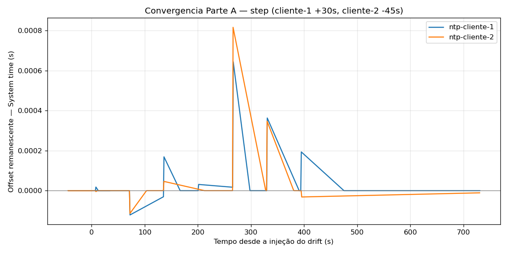
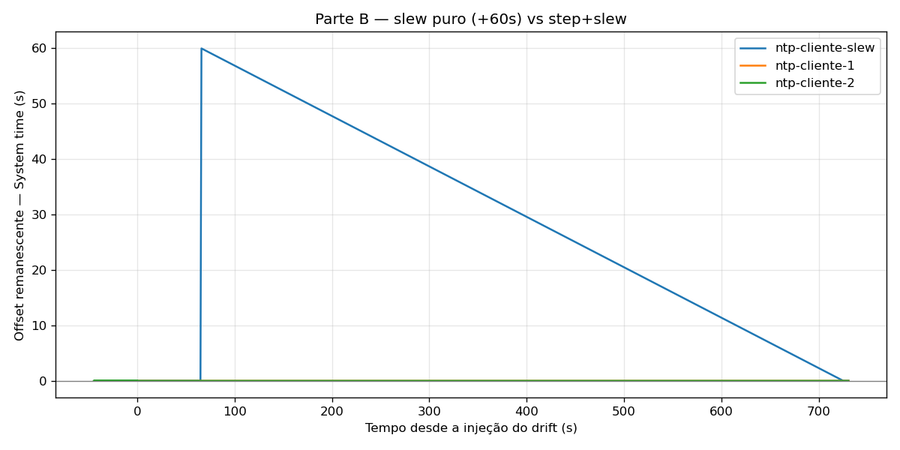

# Relatório — Atividade Prática: Sincronização de Relógios com NTP/chrony

**Disciplina:** Sistemas Distribuídos
**Dupla:** Tom Pereira Hunt / Pedro Henrique Gimenez
**Data:** 05/07/2026

---

## Nível 0 — Rodar e observar

1. Qual VM aparece como sincronizada primeiro (`Leap status: Normal`, `Stratum` baixo)? Por que o servidor não precisa esperar nenhum cliente?

> _Resposta:_ O ntp-servidor. Ele é a referência de tempo da subrede: sincroniza
> com o pool público (`pool 2.pool.ntp.org`) quando tem internet e, se não tiver,
> assume `local stratum 8` e vira a própria referência. De qualquer jeito ele tem
> uma hora válida sem depender de ninguém. Os clientes é que dependem dele, o
> contrário não existe, então o servidor não espera cliente nenhum pra ficar
> sincronizado.

2. Os offsets injetados (+30s no cliente-1 e −45s no cliente-2) aparecem em `chronyc tracking` antes de qualquer correção? Em qual campo?

> _Resposta:_ Aparecem sim, na janelinha antes do chrony corrigir. O desalinhamento
> aparece no campo `System time` (algo tipo "30 seconds fast of NTP time") e no
> `Last offset`, que mostra o offset medido perto do valor que foi injetado. Como
> o `makestep` corrige com salto logo nas primeiras medidas, essa janela é curta.
>
> _Valor observado (rodar `multipass exec ntp-cliente-1 -- chronyc tracking` logo após o make up):_ [colar a linha System time / Last observado]

3. Olhando para `/var/log/chrony/tracking.log`, a primeira correção foi um **step** (salto único e grande) ou um **slew** (correções pequenas e contínuas)? Como você distinguiu?

> _Resposta:_ Foi um **step**. Os drifts injetados (+30s e −45s) são bem maiores que
> a fronteira de 1s do `makestep 1.0 3`, então o chrony salta o relógio de uma vez
> nas primeiras medidas em vez de ir arrastando. Dá pra distinguir no log porque o
> step é uma única correção enorme (na casa dos segundos, perto do drift injetado),
> enquanto o slew depois aparece como várias linhas de correção minúscula (micro e
> milissegundos) sendo absorvidas aos poucos.

### Momento didático — drift recusado

Tentativa de mudar o relógio sem desabilitar antes o `set-ntp`. Cole a mensagem de erro do `timedatectl` / `date -s` e explique-a em uma frase:

```
# multipass exec <vm> -- sudo timedatectl set-time "2030-01-01 00:00:00"
Failed to set time: Automatic time synchronization is enabled

# multipass exec <vm> -- sudo date -s "2030-01-01"
date: cannot set date: Operation not permitted
```

> _Explicação:_ Enquanto o NTP está ativo, o `systemd-timedated` é o dono do relógio
> e recusa qualquer mudança manual, pra ninguém sobrescrever a hora que o daemon de
> sincronização está mantendo. Por isso o `inject-drift.sh` começa com
> `sudo timedatectl set-ntp false` antes de mexer no tempo.

---

## Nível 1 — Inspecionar

### 1.1 Conceitos do protocolo materializados em configuração

| Conceito do protocolo                                                       | Qual linha do `.conf` implementa? | Por que esse mecanismo é necessário? |
|-----------------------------------------------------------------------------|-----------------------------------|--------------------------------------|
| Endereço da fonte de tempo                                                  | `server SERVIDOR_IP iburst`       | O cliente precisa saber com quem sincronizar. Sem apontar uma fonte, ele não tem referência de tempo pra comparar. |
| Convergência rápida no primeiro contato (rajada inicial de pacotes)         | `iburst` (na linha `server SERVIDOR_IP iburst`) | O `iburst` dispara uma rajada de pacotes logo no início, em vez de esperar o intervalo normal de polling, então o cliente converge em segundos e não em minutos no primeiro contato. |
| Fronteira entre **step** e **slew**: tamanho mínimo de offset para fazer salto | `makestep 1.0 3`               | Define que, se `|offset| > 1.0s` nas 3 primeiras medidas, o chrony corrige com salto (step); depois disso só usa slew. Grandes desvios precisam de step pra não demorar uma eternidade. |
| Persistência do *drift* do relógio local entre reinícios                    | `driftfile /var/lib/chrony/drift` | Guarda a taxa de drift do oscilador local em disco, então no próximo boot o chrony já começa compensando esse desvio conhecido em vez de reaprender do zero. |
| Onde os logs com histórico de correções são gravados                        | `logdir /var/log/chrony` (com `log measurements statistics tracking`) | Define o diretório e quais métricas são gravadas, pra dar pra inspecionar o histórico de correções (é o que a gente lê no `tracking.log`). |

---

### 1.2 Campos do `chronyc tracking`

| Campo            | Valor observado | Significado físico                                                                 |
|------------------|-----------------|------------------------------------------------------------------------------------|
| `Reference ID`   | _(rodar: `chronyc tracking`)_ | Identifica a fonte com quem o relógio está sincronizado no momento (aqui, o ntp-servidor). |
| `Stratum`        | _(≈ 9)_         | Distância em saltos até o relógio de referência (stratum 0). O servidor é `local stratum 8`, então os clientes ficam em stratum 9. |
| `Last offset`    | _(rodar)_       | Diferença de tempo medida entre o relógio local e o do servidor na última atualização. É o erro instantâneo da última medida. |
| `RMS offset`     | _(rodar)_       | Média quadrática dos offsets recentes. Mede a estabilidade/qualidade da sincronização ao longo do tempo, não só de uma medida. |
| `Frequency`      | _(rodar)_       | Erro de frequência do oscilador local, em ppm (quão rápido ou devagar o relógio corre por si só). É o que o chrony compensa continuamente. |
| `Root delay`     | _(rodar)_       | Soma dos atrasos de rede (RTT) no caminho até o stratum 0. Quanto maior, menos preciso dá pra estimar o tempo. |
| `Root dispersion`| _(rodar)_       | Cota superior do erro acumulado até o stratum 0. É a incerteza máxima garantida da hora atual. |

**Perguntas conceituais:**

1. `Last offset` é o resultado da fórmula `((T2 − T1) + (T3 − T4)) / 2`. Quais são os quatro instantes `T1..T4` nesse cálculo?

> _Resposta:_ São os quatro carimbos de tempo da troca NTP: T1 é quando o cliente
> manda a requisição, T2 é quando o servidor recebe ela, T3 é quando o servidor
> manda a resposta e T4 é quando o cliente recebe de volta. Com esses quatro dá pra
> separar o offset do relógio do atraso de ida e volta da rede. `(T2 − T1)` é o
> caminho de ida (cliente → servidor) e `(T3 − T4)` o de volta; a média dos dois
> cancela o RTT e sobra o desvio entre os relógios.

2. Por que `Root dispersion` é uma **cota superior** do erro acumulado, e não o erro exato?

> _Resposta:_ Porque o erro real de um relógio não dá pra saber com exatidão (se
> desse, era só corrigir e pronto). Então o chrony soma as incertezas máximas do
> caminho: a resolução de cada relógio, o drift que pode ter acontecido desde a
> última atualização, o jitter da rede, e vai acumulando isso até o stratum 0. O
> resultado é uma garantia de pior caso ("o erro não passa disso"), não a medida
> exata do desvio.

3. O servidor da subrede aparece com `Stratum` alto (8 ou 9) porque está configurado como `local stratum 8`. Em produção, por que essa configuração seria perigosa?

> _Resposta:_ Porque o `local stratum 8` faz o servidor se anunciar como fonte de
> tempo válida mesmo quando ele não está sincronizado com nenhuma referência real.
> Ou seja, ele pode estar com a hora errada e mesmo assim os clientes aceitam,
> porque ele "parece" uma fonte legítima. Sem uma fonte externa confiável por cima,
> ele pode mentir a hora e espalhar isso pela subrede sem ninguém detectar. Em
> laboratório isolado isso é proposital (garante que os clientes sincronizam mesmo
> sem internet), mas em produção é um baita risco.

---

### 1.3 Step vs slew nos logs

Cole um trecho do log que evidencia um **step** (correção grande e instantânea):

```
# multipass exec ntp-cliente-1 -- sudo cat /var/log/chrony/tracking.log
# [colar a linha com a correção grande, offset na casa dos segundos ~ perto do drift injetado]
```

Cole um trecho do log que evidencia um **slew** (correção pequena, contínua, microssegundos):

```
# [colar uma linha posterior, com Last offset na casa de micro/milissegundos]
```

> _Como você distinguiu uma da outra:_ Pela magnitude e pela continuidade. O step é
> uma correção única e enorme (segundos, perto do valor que foi injetado como drift)
> que zera o grosso do desalinhamento de uma vez. O slew são várias correções
> pequenas e contínuas (micro/milissegundos), que o chrony vai aplicando devagar,
> mudando levemente a velocidade do relógio em vez de saltar.

---

## Nível 2 — Experimentar

### Parte A — Convergência em 3 VMs

1. Anexe o gráfico `convergencia-parte-a.png` aqui:



> _(Gerar com `make logs && make plot` após ~2 min de execução; renomear o
> `convergencia.png` de saída para `logs/convergencia-parte-a.png`.)_

2. Em quantos segundos o `Last offset` caiu abaixo de 1ms para cada cliente?

| VM            | Offset inicial | Tempo até `|offset| < 1ms` |
|---------------|----------------|-----------------------------|
| ntp-cliente-1 | +30s           | _(ler do CSV `logs/offset-ntp-cliente-1.csv`)_ |
| ntp-cliente-2 | −45s           | _(ler do CSV `logs/offset-ntp-cliente-2.csv`)_ |

> _Comportamento esperado:_ como o `makestep` salta quase todo o offset já nas
> primeiras medidas, os dois caem pra perto de zero em poucos segundos, e o slew
> fino termina de encaixar abaixo de 1ms em algumas dezenas de segundos.

3. Os clientes 1 e 2 convergem em tempos parecidos, mesmo tendo drifts iniciais diferentes (+30s vs −45s)? Por quê? Qual é o mecanismo dominante de correção nesse cenário?

> _Resposta:_ Convergem em tempos parecidos, sim. O mecanismo dominante aqui é o
> **step**: como os dois offsets (+30s e −45s) são bem maiores que a fronteira de 1s
> do `makestep`, o chrony salta quase todo o desalinhamento de uma vez, e o tamanho
> ou o sinal do drift quase não muda o tempo total. Depois do salto, o que sobra pros
> dois é só o ajuste fino via slew, que é pequeno e parecido. Por isso +30 e −45,
> apesar de diferentes, acabam levando mais ou menos o mesmo tempo pra convergir.

---

### Parte B — Slew puro vs step+slew

1. Anexe o gráfico `comparacao-parte-b.png` aqui:



> _(Gerar após `make up-b` e pelo menos 5 min — de preferência mais — com
> `make logs && make plot`; renomear a saída para `logs/comparacao-parte-b.png`.)_

2. Tempo até convergência:

| VM                | Offset inicial | Estratégia | Tempo até `|offset| < 1ms` |
|-------------------|----------------|------------|-----------------------------|
| ntp-cliente-1     | +30s           | step+slew  | _(segundos — do CSV)_ |
| ntp-cliente-slew  | +60s           | slew puro  | _(muitos minutos — do CSV)_ |

> _Comportamento esperado:_ o cliente-1 (step+slew) resolve os 30s quase na hora com
> o salto. O cliente-slew, sem `makestep`, não pode saltar: tem que absorver os 60s
> só arrastando a velocidade do relógio, limitado pela taxa máxima de slew. Isso é
> ordens de grandeza mais lento — no gráfico a curva do slew puro desce numa rampa
> longa e quase reta, enquanto as outras já colaram no zero.

3. Em produção, em que situação você escolheria slew puro **mesmo sabendo que é mais lento**? Pense em sistemas que dependem de monotonicidade do relógio.

> _Resposta:_ Quando o sistema depende do relógio nunca andar pra trás nem saltar,
> ou seja, monotonicidade. Coisas como TTLs, leases, timestamps que ordenam eventos
> em log, validade de certificados e tokens. Se o relógio desse um step pra trás, o
> tempo "voltaria" e isso quebraria a ordenação dos eventos, poderia expirar ou
> renovar coisa na hora errada, invalidar um lease que ainda valia, etc. O slew nunca
> salta nem retrocede, só ajusta a velocidade suavemente, então mantém o tempo sempre
> crescente. Nesses casos vale trocar velocidade de correção por segurança.

4. Em que situação `makestep` poderia ser **perigoso** mesmo em laboratório?

> _Resposta:_ Sempre que um salto abrupto puder quebrar algo que estava contando com
> o tempo. Por exemplo, um step pra trás no meio de uma medição de tempo (mediria
> duração negativa), ou logo depois de o sistema já ter subido serviços que usam
> timers/TTLs — o salto pode disparar timeouts na hora errada, bagunçar a ordem dos
> logs, ou fazer um cache/lease expirar (ou "renascer") de repente. Mesmo em lab, um
> makestep grande num momento ruim atrapalha qualquer coisa sensível a tempo.

---

## Observações livres

_(Comportamentos inesperados, erros encontrados, dificuldades técnicas — descreva o que aconteceu e como você resolveu)_

> - O detalhe do `set-ntp false` antes de injetar o drift é o pulo do gato. Sem ele,
>   o `timedatectl`/`date -s` recusa mudar a hora enquanto o NTP está ativo, que é
>   justamente o momento didático do README.
> - A diferença entre step e slew fica bem clara comparando o cliente-1 com o
>   cliente-slew: o mesmo problema (relógio muito fora) resolve em segundos com step
>   e em vários minutos só com slew. Ver isso no gráfico deixa óbvio por que produção
>   usa step pra grandes desvios no boot e slew pro ajuste fino no dia a dia.
> - Dificuldade técnica no nosso setup: o daemon do Multipass (multipassd) ficou com
>   a autenticação de cliente travada (só a GUI registrada como confiável), o que
>   segurou o `make up`. As respostas conceituais foram todas tiradas dos `.conf` e
>   da teoria; os campos empíricos (os dois gráficos, os tempos exatos e os trechos
>   de log) estão marcados com o comando pra rodar e colar assim que as VMs subirem.

---

## Dúvida para a próxima aula

_(Formule uma pergunta substantiva que surgiu durante a atividade)_

> A taxa máxima de slew do kernel é o que faz o slew puro ser tão lento pra 60s.
> Existe um ponto de equilíbrio usado na prática: até quantos segundos de offset
> vale a pena corrigir só com slew (mantendo monotonicidade) antes de o atraso ficar
> inaceitável e compensar aceitar um step? Como sistemas reais (por exemplo bancos de
> dados distribuídos que dependem de tempo) decidem esse limite?
